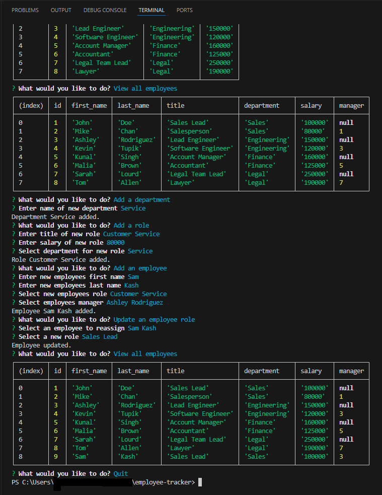

# Employee Tracker

## The Project

This project was designed for an employer to be able to track employee and job data broken up by employees, roles and departments. An employee is able to manipulate data by changing adding and updating values. Other features include:

- The ability to view different sets of data.
- Accessing values on a database.
- An easy to navigate command line interface.

## Link & Contents

- [Video Walkthrough](https://drive.google.com/file/d/1msKsnzdvUPr3sBZJ4UXZXnm0PdJDOju9/view?usp=sharing)
- [Installation](#installation)
- [Usage](#usage)
- [Future Development](#future-development)
- [Credits](#credits)
- [Questions and Feedback](#questions-and-feedback)
- [License](#license)

## Image

## Installation

- Clone the repository to your local machine.
- Update the .env.EXAMPLE file with your postgres login and remove .EXAMPLE from the file name.
- Open gitbash or similar in the root folder.
- Run "npm install".
- Login to postgres by entering "psql -U postgres".
- Enter "\i ./db/schema.sql" to create database.
- Optionally enter "\i ./db/seeds.sql" to enter the preselected employee values.

## Usage

- [Video Walkthrough](https://drive.google.com/file/d/1msKsnzdvUPr3sBZJ4UXZXnm0PdJDOju9/view?usp=sharing)
- After completing all installation instructions navigate to the root folder in gitbash or similar and enter "npm start".
- Use the arrow keys and keyboard to select different options.

## Future Development

Future development ideas include:

- Adding optionality to delete fields.
- Adding additional tables.
- Adding gui component.

## Credits

Project requirements provided by edX/Monash University.

Project set by edX/Monash University. Made use of the Xpert learning assistant, AskBcs and our instructor with troubleshooting issues.

GitHub for hosting the repository.

## Questions and Feedback

If you find any issues or have contributions or feedback you can do so by opening an [issue](https://github.com/Jiske-N/employee-tracker/issues) on Github.

## License

None
